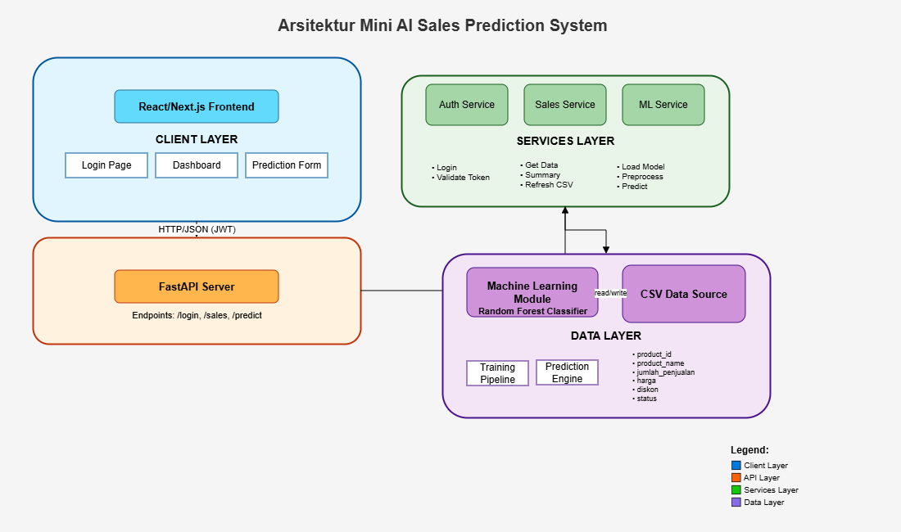
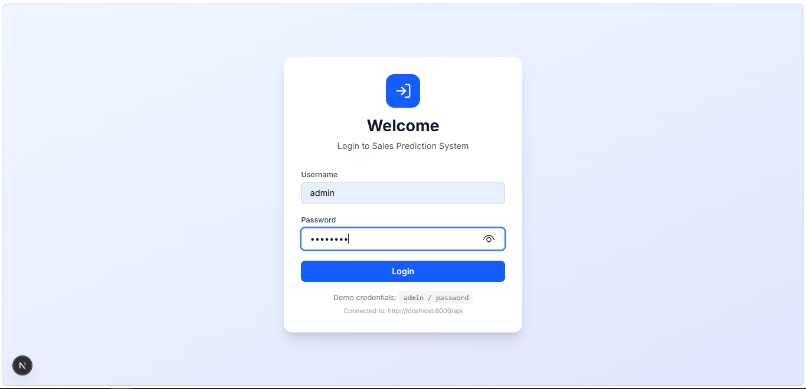
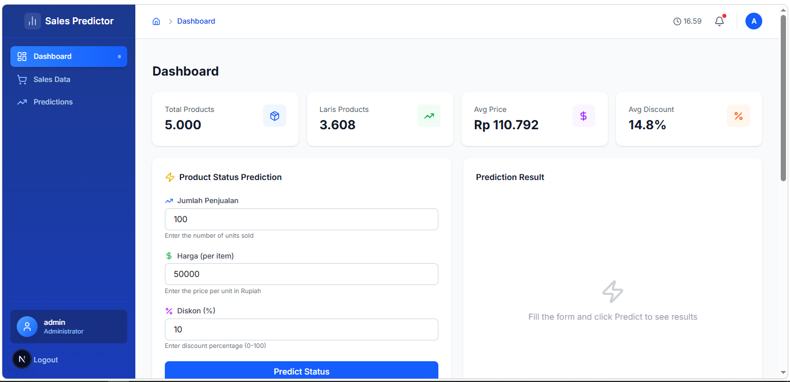
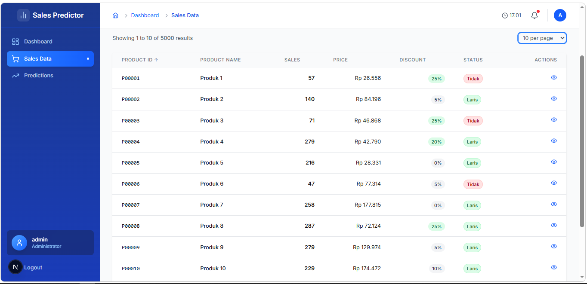
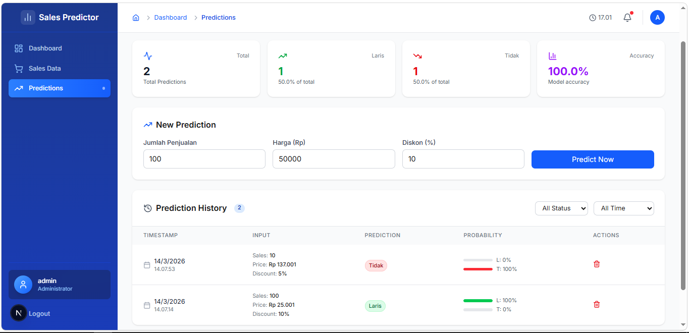
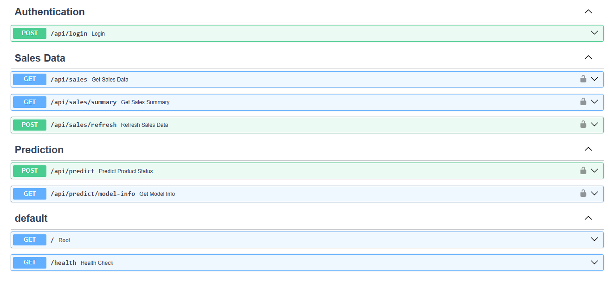

# Mini AI Sales Prediction System

## Cara Menjalankan Project

### Prerequisites

- Python 3.8+
- Node.js 18+
- npm atau yarn

### Frontend

```bash
# 1. Masuk ke folder frontend
cd frontend

# 2. Install dependencies
npm install

# 3. Jalankan development server
npm run dev
```

### Backend (FastAPI)

```bash
# 1. Masuk ke folder backend
cd backend

# 2. Buat virtual environment
python -m venv venv
# Windows: venv\Scripts\activate
# Mac/Linux: source venv/bin/activate

# 3. Install dependencies
pip install -r requirements.txt

# 4. Train model
python ml/train_model.py

# 5. Jalankan server
python run.py
```

## System Design

### Arsitektur Diagram

```

```

### Alur Data

**1. Alur Autentikasi**

- User mengisi form login di frontend → POST `/api/login`
- Backend memverifikasi credentials (admin/password)
- Backend mengembalikan JWT token
- Frontend menyimpan token di localStorage

**2. Alur Data Penjualan**

- Frontend request GET `/api/sales` dengan menyertakan token
- Backend memvalidasi token via Auth Service
- Sales Service membaca data dari `sales_data.csv`
- Data dikembalikan ke frontend dalam format JSON
- Frontend menampilkan data dalam tabel

**3. Alur Prediksi**

- User input (jumlah_penjualan, harga, diskon) → POST `/api/predict`
- Backend validasi token dan input
- ML Service memuat model (`model.pkl`) dan scaler (`scaler.pkl`)
- Input discaling dan diproses oleh Random Forest
- Model mengembalikan prediksi ("Laris"/"Tidak") dan probability score
- Hasil dikirim ke frontend dan ditampilkan
- Prediksi otomatis tersimpan di localStorage sebagai history

**4. Alur Refresh Data**

- Admin klik tombol refresh → POST `/api/sales/refresh`
- Backend membaca ulang file CSV
- Data terbaru dikirim ke frontend

### Penjelasan Singkat

Sistem ini menggunakan arsitektur **3-layer** yang terpisah:

**1. Client Layer (React/Next.js)**

- Bertanggung jawab untuk tampilan dan interaksi user
- Halaman: Login, Dashboard, Sales Data, Predictions
- State management menggunakan React hooks
- Penyimpanan lokal untuk token JWT dan history prediksi

**2. API & Services Layer (FastAPI)**

- REST endpoints dengan autentikasi JWT
- Auth Service: mengelola login dan validasi token
- Sales Service: operasi CRUD pada data CSV
- ML Service: integrasi dengan model machine learning

**3. Data Layer**

- **Machine Learning Module**: Random Forest classifier yang sudah ditraining dengan 500+ sample data, akurasi ~89%
- **CSV Data Source**: Menyimpan data historis penjualan dengan format:
  - `product_id`: ID unik produk (contoh: ELEC0001)
  - `product_name`: Nama produk
  - `jumlah_penjualan`: Jumlah unit terjual
  - `harga`: Harga per unit dalam Rupiah
  - `diskon`: Persentase diskon (0-100)
  - `status`: Label "Laris" atau "Tidak" (untuk training)

**Komunikasi Antar Layer:**

- Client ↔ API: HTTP/JSON dengan JWT
- API ↔ Services: Function calls internal
- Services ↔ Data: File I/O untuk CSV, joblib untuk model

**Keunggulan Arsitektur:**

- **Separation of concerns**: Setiap layer punya tanggung jawab spesifik
- **Scalability**: Mudah menambah fitur baru
- **Testability**: Setiap komponen bisa diuji terpisah
- **Maintainability**: Kode terstruktur dan mudah dipelihara

## Struktur Project

```
sales-prediction-system/
├── backend/                    # FastAPI backend
│   ├── app/
│   │   ├── api/               # API endpoints
│   │   ├── core/              # Config & security
│   │   ├── models/             # Pydantic schemas
│   │   ├── services/           # Business logic
│   │   ├── utils/              # Helpers
│   │   └── main.py              # App entry point
│   ├── data/                    # Data generator
│   ├── ml/                       # ML training scripts
│   └── run.py                    # Server runner
├── frontend/                   # Next.js frontend
│   ├── app/
│   │   ├── (auth)/             # Login pages
│   │   ├── (dashboard)/         # Dashboard pages
│   │   ├── components/          # React components
│   │   ├── hooks/               # Custom hooks
│   │   ├── lib/                 # Utilities
│   │   └── types/               # TypeScript types
│   └── public/                   # Static assets
├── data/                         # CSV data files
│   └── sales_data.csv
├── ml/                            # ML models
│   ├── model.pkl
│   ├── scaler.pkl
│   └── metadata.json
├── screenshots/                   # Screenshots for README
└── README.md
```

## API Documentation

```bash
Base URL Interaktif:

`http://localhost:8000/api/docs` OR `http://localhost:8000/api/redoc`
```

## Ringkasan

Sistem ini adalah aplikasi fullstack untuk memprediksi status produk (Laris/Tidak) berdasarkan data penjualan historis menggunakan Machine Learning.

### Tujuan

- Mengelola data penjualan dari CSV
- Memprediksi status produk dengan model Random Forest
- Menampilkan hasil dalam dashboard interaktif

### Design Decision

| Komponen     | Teknologi     | Alasan                                                                       |
| ------------ | ------------- | ---------------------------------------------------------------------------- |
| **Backend**  | FastAPI       | Performa tinggi, auto-documentation (Swagger), type hints dengan Pydantic    |
| **Frontend** | Next.js       | Server-side rendering, routing mudah, integrasi React yang seamless          |
| **ML Model** | Random Forest | Stabil, akurat (~89%), memberikan probability score, tidak mudah overfitting |
| **Auth**     | JWT           | Stateless, sederhana, aman untuk demo                                        |
| **Database** | CSV           | Sesuai requirement, sederhana, mudah dipindahkan                             |
| **Styling**  | Tailwind CSS  | Responsif, utility-first, cepat dikembangkan                                 |

### Alur Sistem

1. User login → mendapat JWT token
2. Dashboard menampilkan data penjualan dari CSV
3. User input (jumlah_penjualan, harga, diskon) → dikirim ke API
4. Model Random Forest memproses → mengembalikan prediksi + probability
5. History tersimpan di localStorage

### Asumsi yang Digunakan

1. **User**: Dummy credential `admin/password` untuk testing
2. **Data**: File CSV sebagai single source of truth
3. **Model**: Random Forest dengan akurasi ~89% (dari hasil training)
4. **Token**: JWT expires dalam 30 menit
5. **Environment**: Development mode (debug=true, CORS localhost)
6. **History**: Tersimpan di localStorage (bukan database)
7. **Data Sample**: Digenerate otomatis jika file CSV tidak ditemukan

## Screenshots

### Halaman Login


Halaman login dengan form sederhana (username: admin, password: password)

### Dashboard - Summary Cards


Menampilkan ringkasan statistik: Total Products, Laris Products, Avg Price, Avg Discount

### Dashboard - Tabel Data Penjualan


Tabel data penjualan dengan fitur search, filter, sorting, dan pagination

### Dashboard - Prediksi


Form untuk memprediksi status produk dengan 3 input fields

### Dokumentasi API (Swagger)


Dokumentasi API interaktif dengan Swagger UI
